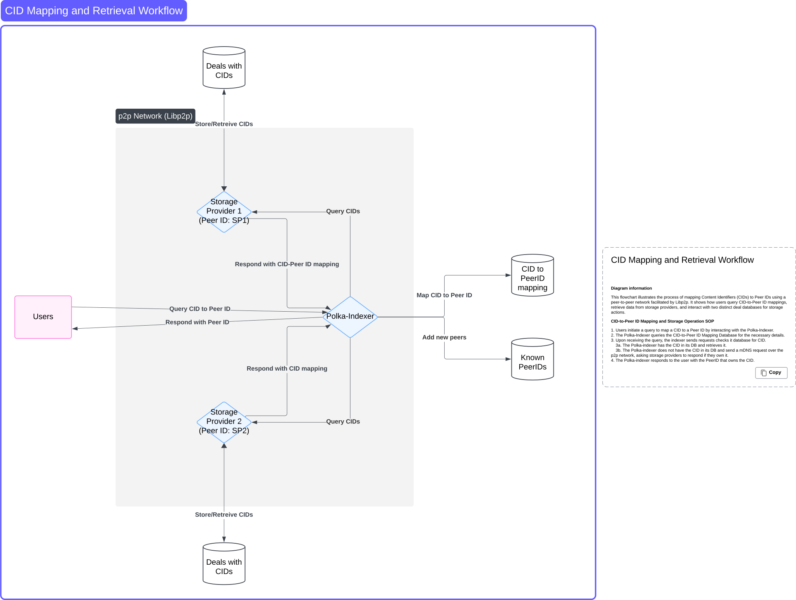

# RFC-001: Polka-index

## Abstract

This document describes Polka-index, a indexing application that maps Content Identifiers (CIDs) to the Peer IDs of storage providers in a peer-to-peer (P2P) network. Users interact with Polka-index through a simple JSON API, while Polka-Index communicates with storage providers over a P2P network using [libp2p](https://docs.libp2p.io/). This document outlines the system's architecture, key components, and communication protocols.

## Introduction

In the polka-storage system it can be hard to find which CID is owned by which storage provider. Polka-index solves this problem by connecting CIDs (unique identifiers for files) to the Peer IDs of storage providers who store them.

Storage providers store files outside the scope of the P2P network. Instead, they use the network to broadcast their Peer IDs and respond to CID queries from the Polka-Index. Users can easily request CID-to-Peer ID mappings from the Polka-Index.

This document explains how the system works, detailing how users, the Polka-Index, and storage providers interact in the network.

## Terminology

- **CID (Content Identifier)**: A unique identifier for a file stored by a storage provider.
- **Peer ID**: A unique identifier for a node in the P2P network.
- **Storage Provider**: A node in the network that stores files and manages a database of CIDs but uses the P2P network only to share Peer IDs and provide CID mappings.
- **Deal Database**: A local database in each storage provider where CIDs and metadata about stored files are recorded.
- **Polka-Index**: The node responsible for querying storage providers and maintaining a database of CID-to-Peer ID mappings. It also provides an JSON API for users.

## System Overview

### Bootstrap Nodes

Bootstrap nodes are predefined, well-known, persistent nodes in a [libp2p](https://docs.libp2p.io/) network. They serve as the initial points of contact for peers attempting to join the network. Unlike other peers, they are expected to have a stable presence and consistent availability. Bootstrap nodes help new peers find other peers in the network by providing information about existing nodes.

Bootstrap nodes are defined by their [multiaddrs (multi-protocol addresses)](https://github.com/libp2p/specs/blob/master/addressing/README.md#multiaddr-in-libp2p). These are made available through configuration files.

When a new peer joins, they attempt to establish a connection to one or more bootstrap nodes using their [multiaddrs](https://github.com/libp2p/specs/blob/master/addressing/README.md#multiaddr-in-libp2p). The bootstrap node responds by sharing the addresses of other peers it knows about. The new peer uses the addresses provided by the bootstrap node to connect to additional peers. Over time, the new peer's routing table is populated, allowing it to interact with the network without relying exclusively on the bootstrap nodes.

Storage providers have a incentive to run bootstrap nodes in the P2P network because it enhances their trustworthiness and visibility within the ecosystem. As bootstrap nodes, storage providers aid in peer discovery, enabling new and existing peers to connect more easily to the network. This presence not only benefits the network's overall health and connectivity but also reflects positively on the storage provider's reliability and commitment to the decentralized storage ecosystem.
Trust is critical factor for storage clients selecting which storage provider to store their data. A provider that operates a bootstrap node demonstrates that they want to support the broader network, increasing confidence and trustworthiness among clients. Bootstrap nodes and contribute to a more seamless user experience by helping ensure that content can be discovered and retrieved efficiently. This increase in trustworthiness can lead to increased client adoption and preference for storage providers that operate bootstrap nodes, giving these providers a competitive advantage in the ecosystem.

Storage providers and bootstrap node operators have an incentive to run an indexer node. By running an indexer, these participants contribute directly to the discoverability of content, ensuring that their stored data can be easily located and accessed by clients. This active involvement in indexing enhances their reputation and trustworthiness within the ecosystem, as it demonstrates a commitment to supporting the network's functionality and reliability. For storage providers, running an indexer reinforces their role as dependable custodians of data, while bootstrap node operators strengthen their reputation as key supporters of the network.

### Peer Discovery

The [identify protocol](https://github.com/libp2p/specs/blob/master/identify/README.md#identify-v100) plays a vital role in peer discovery and establishing communication. This protocol allows peers to exchange metadata about themselves upon connection. This metadata includes:

- **Peer ID**: A unique identifier for the peer.
- **Multiaddrs**: Addresses where the peer can be reached.
- **Supported Protocols**: A list of protocols the peer supports.

The [identify protocol](https://github.com/libp2p/specs/blob/master/identify/README.md#identify-v100) facilitates peer discovery by enabling nodes to exchange information upon establishing a connection. When a new peer joins the network, it connects to a well-known bootstrap nodes that assist in the initial discovery process. Upon connecting to a bootstrap node, the [identify protocol](https://github.com/libp2p/specs/blob/master/identify/README.md#identify-v100) is employed to share details such as the node's unique Peer ID, supported protocols, and reachable [multiaddrs (multi-protocol addresses)](https://github.com/libp2p/specs/blob/master/addressing/README.md#multiaddr-in-libp2p). This exchange allows the new peer to learn about the network's topology and available services. The bootstrap node provides information about other peers it knows, facilitating the new node's integration into the network. The bootstrap node keeps up-to-date information about peers through the exchange of the identify messages. This mechanism ensures that nodes can dynamically discover and connect with each other. After the peer discovery is done the node can subscribe to the available [gossipsub](https://github.com/libp2p/specs/blob/master/pubsub/gossipsub/README.md) topics to exchange information about deals.

### Storage Providers

Storage providers are nodes in the Polka-Index ecosystem, responsible for storing files and managing metadata that links Content Identifiers (CIDs) to their respective storage details. While the actual file storage occurs outside the scope of the P2P network, storage providers leverage the network to facilitate content discovery. They broadcast their Peer IDs to the network, making their presence known and enabling Polka-Index to query them for CID mappings.

Each storage provider maintains a local Deal Database, implemented using RocksDB, a high-performance key-value store. Storage providers must notify the network of any new deals and any deals that have expired to ensure that Polka-Index has up to date information. This information exchange is done by sending [gossipsub](https://github.com/libp2p/specs/blob/master/pubsub/gossipsub/README.md) messages to topics that the Polka-Index is subscribed to.

By integrating with the P2P network and facilitating metadata exchange, storage providers play a crucial role in the Polka-index architecture, bridging the gap between decentralized file storage and efficient content lookup.

The polka storage server will be extended to be part of the P2P network, connecting and sharing their peer ID on start-up. Any state changes to the Deal Database will be broadcasted to the relevant topics in the P2P network so Polka-Index can update their information.

### Polka-Index

Polka-Index serves as the central indexing and query service in the network, bridging users and storage providers by mapping Content Identifiers (CIDs) to the Peer IDs of nodes storing the associated data. Polka-Index specializes in organizing and disseminating metadata about where specific content can be found.

Polka-Index plays a crucial role in information aggregation through the use of the [gossipsub protocol](https://github.com/libp2p/specs/blob/master/pubsub/gossipsub/README.md), a pub-sub mechanism that allows it to subscribe to specific topics. Storage providers publish deal information to these topics, enabling Polka-Index to listen for updates and build an up-to-date database of CID-to-Peer ID mappings.

When an indexer node first connects to the P2P network, it catches up on existing deal information by identifying itself and requesting the current state of all deals. This is done through a dedicated gossipsub topic separate from the one used for real-time updates. By subscribing to this "catch-up" topic, the indexer can retrieve a complete snapshot of existing deal data, ensuring it starts with a full and accurate view of the network’s content before listening for new updates.

By collecting and indexing this deal information, Polka-Index allows users to query the network through a JSON API, retrieving the Peer ID of a storage provider responsible for a specific CID. This approach simplifies content discovery, offering users an efficient method to locate content without requiring direct interaction with the P2P network.

### Users

Users in the Polka-index network act as requesters of information, leveraging the system to locate and retrieve metadata about content stored by storage providers. They query Polka-Index for mappings between Content Identifiers (CIDs) and the Peer IDs of storage providers. By doing so, users can identify the nodes responsible for storing specific data without directly interacting with the P2P network or storage providers.

Through Polka-Index’s JSON API, users send simple queries containing the CID of interest and receive the associated Peer ID in response. This abstraction streamlines the content discovery process, enabling users to focus on their applications without needing to understand the complexities of the underlying network protocols.

The user’s role is entirely client-facing, relying on Polka-Index as the intermediary to interact with the network, gather deal-related data, and provide accurate CID-to-Peer ID mappings. This design ensures that users experience a straightforward and efficient method for accessing decentralized storage metadata, enhancing accessibility and usability in the network.

### Architecture Diagram

The following diagram illustrates the architecture of Polka-index:

### References

[libp2p Documentation](https://docs.libp2p.io/)
