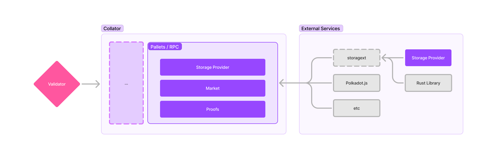

# Architecture Overview

The Polka Storage parachain is, just like other parachains, composed of collators that receive extrinsics calls,
and through them perform state transitions.

## System Overview

From left to right, we have validators (represented by a single one as only one validates blocks at a time),
collators, storage providers and their respective storage.

The validators are out of the scope of this project, validating the blocks submitted by a collator selected at random
(the selection process is not covered here).

The collators run our parachain runtime and process extrinsic calls from the storage providers —
such as proof of storage submissions.
The storage providers are independent of the collators, being controlled by arbitrary people that provide storage to the system.
Storage management is left to the storage providers, being responsible to keep their physical system in good shape to serve clients.

## Collator Overview

Taking a deeper dive into the collator architecture, our main focus is on developing the core parachain pallets —
currently, the storage provider and market pallets.
The collator automatically exposes a JSON-RPC API for the extrinsics calls,
this API can then be called from a library such as `storagext`, Polkadot.js,
or even just with raw HTTP and JSON-RPC payloads.

The storage provider interacts with the collator through the `storagext` API,
first registering themselves in the network, registering deals and eventually submitting proofs for validation.

The validation of the proofs is not done by the collator per-se, but rather by an offchain worker,
that can be hosted along with the collator or not. This is due to the WASM runtime limitations —
we cannot run proof verification inside it.
