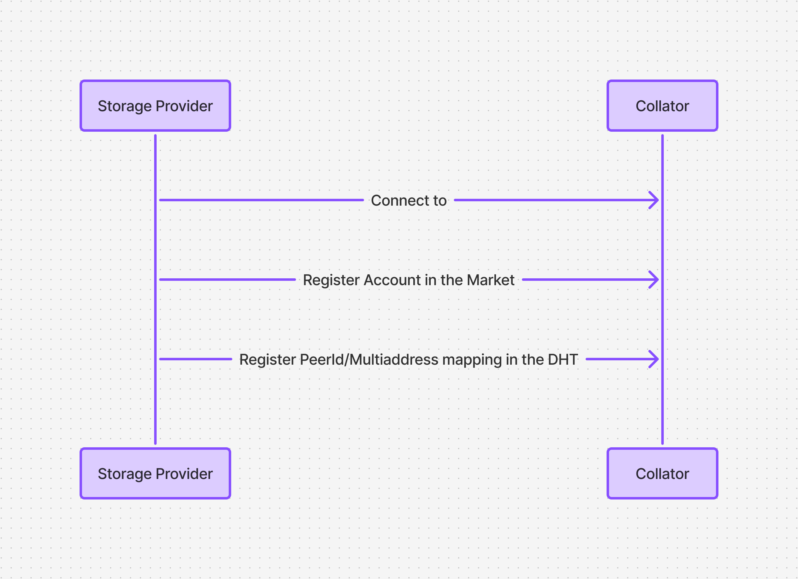
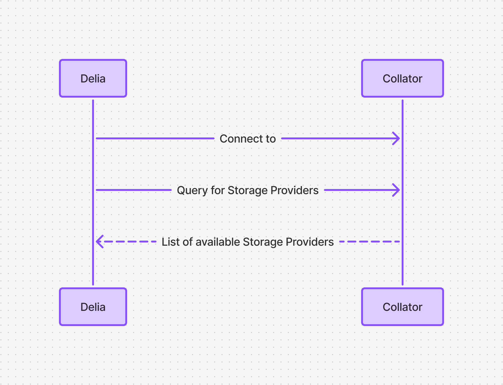
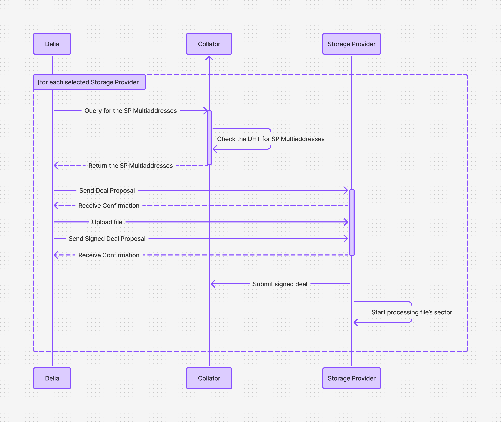

<!-- TODO: replace mermaid code with proper svg -->

# Delia — the Polka Storage dApp

Delia is our application enabling non-technical users to onboard their data to our network's storage providers.

This document will cover how Delia fits in the rest of the system and how it communicates with it.

> For more information on how to use Delia, refer to its [README](https://github.com/eigerco/delia/blob/main/README.md).

All dApps must connect somewhere to work, Delia is no different and *must* connect to a parachain collator when starting.
After the connection is established, Delia becomes able to interact with the chain, this includes (but is not limited to):

* Accesing the faucet drips
* Depositing and withdrawing funds from the market account
* Querying the list of storage providers

## What happens before Delia

We must remember that Delia interacts with the Storage Providers too.
The Storage Providers require some setup, it's simple though:
* First, they register on chain
* Then, while connected to the Collator, register their PeerId and Multiaddresses with the Collator's DHT —
this allows clients to resolve a storage provider's PeerId and connect to them

<!-- ```mermaid
sequenceDiagram
    Storage Provider->>Collator: Connect to
    Storage Provider->>Collator: Register account in the Market
    Storage Provider->>Collator: Register PeerID to Multiaddress in the DHT
``` -->



## Uploading a file through Delia

After the Storage Providers have done their setup,
they will be listed when Delia loads, for this to happen,
Delia connects to the Parachain Collator and queries the chain for the list of available storage providers.

<!-- ```mermaid
sequenceDiagram
    Delia->>Collator: Connect to
    Delia->>Collator: Query for Storage Providers
    Collator- ->>Delia: List of available Storage Providers
``` -->


> The client's storage deal will not be covered here, please refer to the Delia page for details.

Once the user submits their deal, Delia will go through the selected providers,
retrieve their multiaddresses and submit the deal to each one, proposing it, uploading the file
and finalizing it by sending a signed deal to the Storage Provider.
Afterwards, the Storage Provider will submit the deal on chain and start processing the deal as soon as possible.

<!-- ```
sequenceDiagram
    loop for each selected Storage Provider
    Delia->>Storage Provider: Propose deal
    Delia->>Storage Provider: Upload file
    Delia->>Storage Provider: Sign & send deal
    Storage Provider->>Collator: Submit signed deal
    Storage Provider->>Storage Provider: Start sealing deal in sector
    end
``` -->



