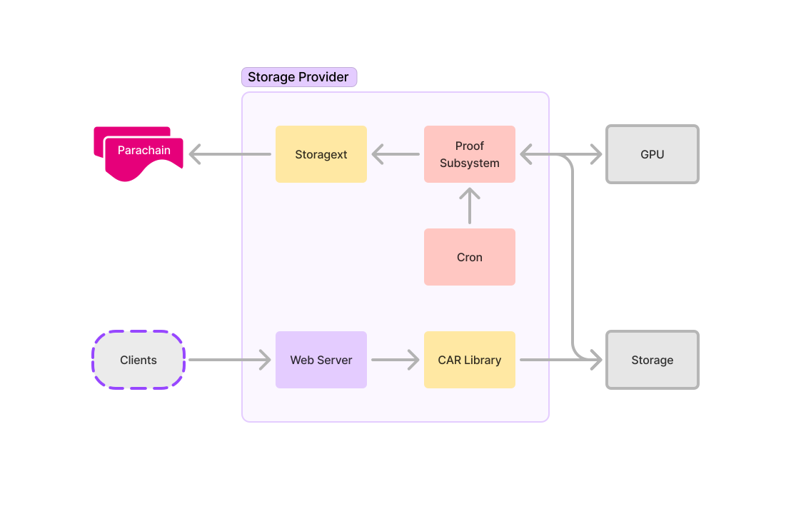

# Architecture Overview

The Polka Storage parachain is, just like other parachains, composed of collators that receive extrinsics calls,
and through them perform state transitions.

## System Overview

From left to right, we have validators (represented by a single node as only one validates blocks at a time),
collators, storage providers and their respective storage.

The validators handled by Polkadot itself, validating the blocks submitted by a collator selected at random
(the selection process is not covered here).

The collators run our parachain runtime and process extrinsic calls from the storage providers —
such as proof of storage submissions.
The storage providers are independent of the collators and are controlled by arbitrary people who provide storage to the system.
Storage management is left to the storage providers, being responsible to keep their physical system in good shape to serve clients.

## Collator Overview

Taking a deeper dive into the collator architecture, our main focus is on developing the core parachain pallets —
currently, the storage provider and market pallets.
The collator automatically exposes a JSON-RPC API for the extrinsics calls,
this API can then be called from a library such as [`storagext`](./storagext-cli/index.md), Polkadot.js,
or even just with raw HTTP and JSON-RPC payloads.

The storage provider interacts with the collator through the defined extrinsics,
first registering themselves in the network, registering deals and eventually submitting proofs for validation.

Proof validation is done on the collator, inside the WASM runtime;
this is triggered by the Storage Provider Pallet and handled by the Proofs Pallet.

## Storage Provider Overview

The storage provider is composed of the proof subsystem which proves the storage,
a cron-like service that schedules the proving process and the CAR library that validates CAR files submitted by the user.

The client submits prepared CAR files over Graphsync, which the CAR library then validates — verifies the contents match the CID.

After the data has been submitted, it needs to be proven, the cron will schedule the proving process for each deal accepted from the clients.

## Resources on Parachains

Reading:
* [Parachains' Protocol Overview](https://wiki.polkadot.network/docs/learn-parachains-protocol)
* [The Path of a Parachain Block](https://polkadot.com/blog/the-path-of-a-parachain-block)

Videos:
* [Introduction to Polkadot, Parachains, and Substrate](https://www.youtube.com/live/gT-9r1bcVHY?si=dmCJyWB5w2NY1bnu&t=1670)
* [The Path of a Parachain Block - Joe Petrowski](https://www.youtube.com/watch?v=vRsBlVELQEo)
* [The Path of a Parachain Block on Polkadot and Kusama Network](https://www.youtube.com/watch?v=m0vxqWwFfDs)

