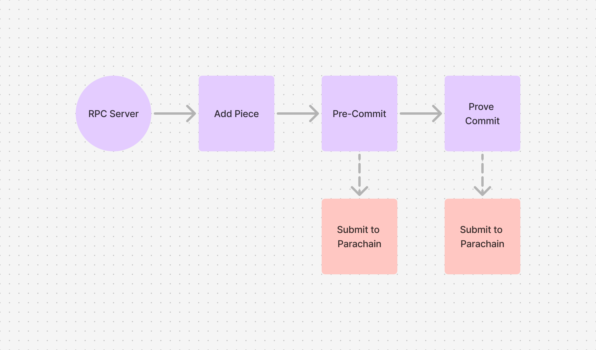

# Polka Storage Provider — Server Architecture

The server has two main fronts, the JSON-RPC API which provides an interface for users to submit deal proposals to the storage provider,
and the HTTP API which consists of a single endpoint where users are to submit their data — as illustrated below.

The user is first required to propose a deal, which once accepted by the storage provider (signaled by the return of a CID) allows the user to submit a file
(using `curl` for example) to the server; finally the user can then publish a signed deal to the storage provider. For more details, see the [File Upload Demo](../getting-started/file-upload.md).

The responsibility then falls on to the storage provider to seal, publish and activate the deal on the Polka Storage parachain.

## JSON-RPC API

The JSON-RPC endpoint exposes the following methods:

<code>info</code> — which returns information about the Storage Provider.

<b>JSON-RPC Example</b>

<pre>
<code class="language-json hljs">{
  "jsonrpc": "2.0",
  "id": 0,
  "method": "v0_info",
  "params": []
}</code>
</pre>

<code>propose_deal</code> — accepts a deal proposal and returns a CID for the file upload.

<b>JSON-RPC Example</b>

<pre>
<code class="language-json hljs">{
  "jsonrpc": "2.0",
  "id": 0,
  "method": "v0_propose_deal",
  "params": [
    {
      "piece_cid": "baga6ea4seaqj527iqfb2kqhy3tmpydzroiigyaie6g3txai2kc3ooyl7kgpeipi",
      "piece_size": 2048,
      "client": "5GrwvaEF5zXb26Fz9rcQpDWS57CtERHpNehXCPcNoHGKutQY",
      "provider": "5FLSigC9HGRKVhB9FiEo4Y3koPsNmBmLJbpXg2mp1hXcS59Y",
      "label": "",
      "start_block": 200,
      "end_block": 250,
      "storage_price_per_block": 500,
      "provider_collateral": 1250,
      "state": "Published"
    }
  ]
}</code>
</pre>

<code>publish_deal</code> — after a file has been uploaded, accepts a signed deal for publishing.

<pre>
<code class="language-json hljs">{
  "jsonrpc": "2.0",
  "id": 0,
  "method": "v0_publish_deal",
  "params": [
    {
      "deal_proposal": {
        "piece_cid": "baga6ea4seaqj527iqfb2kqhy3tmpydzroiigyaie6g3txai2kc3ooyl7kgpeipi",
        "piece_size": 2048,
        "client": "5GrwvaEF5zXb26Fz9rcQpDWS57CtERHpNehXCPcNoHGKutQY",
        "provider": "5FLSigC9HGRKVhB9FiEo4Y3koPsNmBmLJbpXg2mp1hXcS59Y",
        "label": "",
        "start_block": 100000,
        "end_block": 100050,
        "storage_price_per_block": 500,
        "provider_collateral": 1250,
        "state": "Published"
      },
      "client_signature": {
        "Sr25519": "c835a1c5215fc017067d30a8f49df0c643233881e57d8bd7232f695e1d28c748e8872b45712dcb403e28792cd1fb2b6161053b3344d4f6664bafec77349abd80"
      }
    }
  ]
}</code>
</pre>

## HTTP API

The HTTP API exposes a single PUT method — `/upload/<cid>` where `<cid>` is the CID returned as a result of `propose_deal`.

## Sealing Pipeline

As shown in the previous illustration, the sealing pipeline is responsible for gathering pieces into sectors, sealing said sectors and proving their storage.
To achieve that, the pipeline is (currently) composed of 3 main stages.

### Add Piece

The Add Piece stage gathers pieces into unsealed sectors, preparing them for the following steps.

Given we're currently only supporting sectors with 2KiB size, we're converting single pieces into sectors —
when a piece comes in, we convert it to a single sector, without gathering multiple pieces.

### Pre Commit

By itself, the Pre Commit has two inner stages — Pre Commit 1 (PC1) and Pre Commit 2 (PC2).
PC1 is responsible for generating the [Stacked Depth Robust Graph](https://spec.filecoin.io/algorithms/sdr/#section-algorithms.sdr.stacked-depth-robust-graphs),
while PC2 is responsible for handling the construction of the [Merkle tree and proofs](https://spec.filecoin.io/algorithms/sdr/#section-algorithms.sdr.merkle-proofs).
After this process is completed, the Pre Commit information is submitted to the chain for verification.

### Prove Commit

The Prove Commit stage is where the [Proof of Replication](https://docs.filecoin.io/basics/the-blockchain/proofs#proof-of-replication-porep) is generated,
after generation it is submitted to the network for validation and the sector is finally marked as `Active`,
signaling that the Storage Provider has effectively stored the sector and is ready to start performing regular proof submissions.

<!-- TODO: remove the download API from the server until we implement deal retrieval -->
