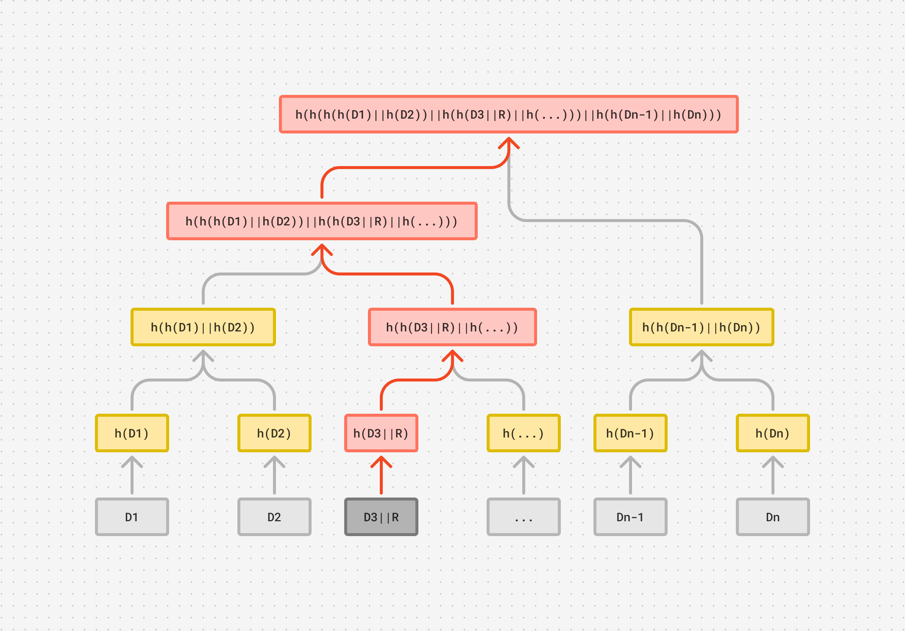
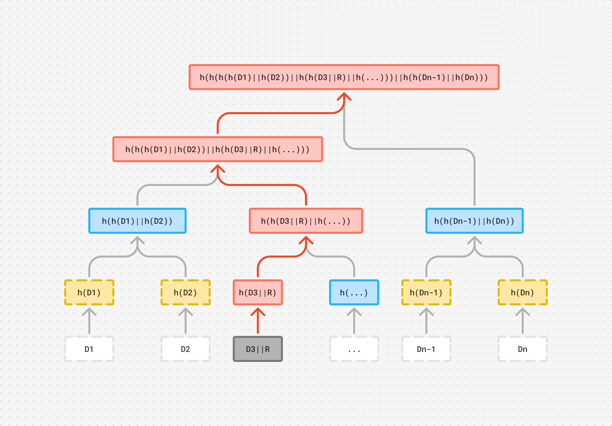
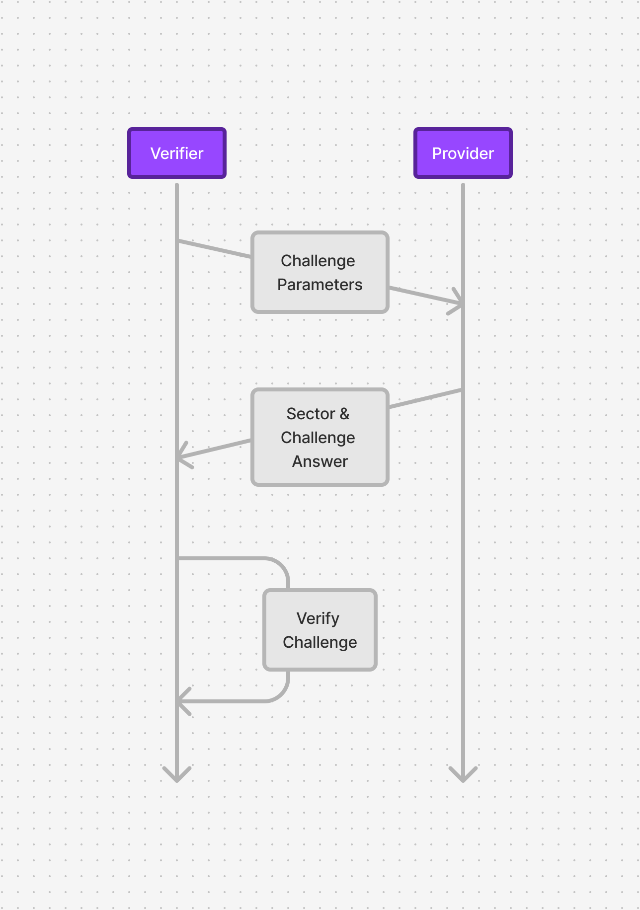

# Background

This page provides a quick background behind our approach to the storage challenge.

## Why another storage system?

In short, to be fully native to Polkadot (and as a bonus — no trusted execution environment is required).

For a longer explanation, our vision is fully embedded in the Polkadot vision of the ubiquitous supercomputer; and as you know, a computer requires storage.

Achieving storage native to Polkadot means using DOT as *the* token for our solution, instead of creating a parallel economy relying on yet another token, further fragmenting the space.

## Why not X?

We've decided to build our storage solution based on the ideas behind Filecoin, not because it's different from the other available networks in Polkadot, but rather because Filecoin does a lot of things right, and we want to bring them to Polkadot.

For those unfamiliar with Filecoin, it is a blockchain network that provides a *file* storage marketplace. In a nutshell, people provide storage space (a storage provider), creating several offers (distinguished by price, reputation, etc) and clients can pick one of these storage providers to store their data for them.

This raises the question — *How does the network know that the storage provider does have my data?*

Therein lies the crux of Filecoin! You can solve this in multiple ways, each with different levels of flexibility, but we will outline two.

### Merkle Trees and Proofs

> If you’re not familiar with Merkle trees, you can read the explainer from BitPanda — <https://www.bitpanda.com/academy/en/lessons/everything-you-need-to-know-about-merkle-trees/>
>

Consider that you build a Merkle tree out of a file, the root of the Merkle tree is derived of several layers of hashes meaning that if you change one of those layers, such as a leaf, the resulting tree will have a different root — as illustrated below, `D3` was changed to `D7` which cascades into a different final hash.

Merkle proofs are similar, but instead of sharing the whole file, the tree alone can be shared, if the verifier and the provider have different trees, it means somewhere down the tree there’s a difference!

With this in mind, you can challenge storage providers holding a given file by selecting a random data leaf (i.e. a piece of the file) and sending them a random number — as illustrated in the figure below, the random number `R` is concatenated to the sector `D3` — the idea is, the storage provider cannot guess the random number, so, if they’re able to generate a tree with the random number, it must mean they have the file!

At the same time you, the challenger, must also build a Merkle tree on your end, you do this by receiving the random data leaf that you selected and building the tree, in the end, if they do not match, the storage provider is cheating you!

This is illustrated in the following picture, you — the verifier — just received the leaf `D3` and the random number `R`, you concatenate them together (`D3||R`) and you’re ready to recompute the tree. In red, you find the nodes directly affected by the change, these are the ones that **must** be recomputed — of course, you can always compute the tree from scratch; using `h(D1), h(D2), ...` but that is wasteful as the nodes marked in blue and their children did not change, and as such, you can just reuse them.

This approach is great for small batches of data, it does not require any special hardware and can be implemented with different kinds of hashes, providing flexibility and lowering entry requirements for storage providers.

However, this approach does not scale well because the challenger is required to receive both the Merkle tree *and* the random data leaf that is being challenged — as illustrated below.

Now, consider that you need to do this over and over while you keep the file, over time, all those data blocks start accumulating and you end up transferring a lot of data over the network! Furthermore, you can't just request any size of data; if it is too small, the storage provider may cheat and brute force a solution; if it is too big, the transfer may take too long to be practical.

### Zero Knowledge Proofs

So, we've established that we can't transfer much data through the network, but it cannot be possible to brute force a solution. That's where Filecoin's solution comes in, they had the brilliant insight that you can use the random challenges along with zero-knowledge proofs for that. Filecoin's zero-knowledge proofs are constant in size, easy to verify and hard to fake.

The generation of these proofs do not require special hardware features like trusted platform modules — you can generate a proof using your CPU, however, you will need a GPU if you want to generate proofs for larger files in practical time.

In Filecoin, uploaded files (or deals) are combined into sectors, which the zero knowledge proofs are based on (and [directed acyclic graphs](https://www.youtube.com/watch?v=8_9ONpyRZEI), but we’re not covering that here). At this point Merkle trees are built over the original file and the final sector, both in its unsealed and sealed state. The root of each tree is then used when constructing the replication proof, similarly, the root of the sealed sector is used for the proofs of storage over time.

Proof validation requires fewer resources than the generation step, enabling us to verify the storage proofs inside the Polkadot runtime. Their small size translates to less stress on the network; for example, Filecoin proofs can go from 192 bytes to a few KB in size, in comparison, a 1080p video frame, encoded using H.264 will be between 100 and 500 KB — note that video will usually be streamed at 24 frames per second or higher, the proof size pales in comparison!

#### Relevant Links

* <https://www.youtube.com/watch?v=RhEVZcsWkx0>
* <https://www.youtube.com/watch?v=GRaR8N380h0>
