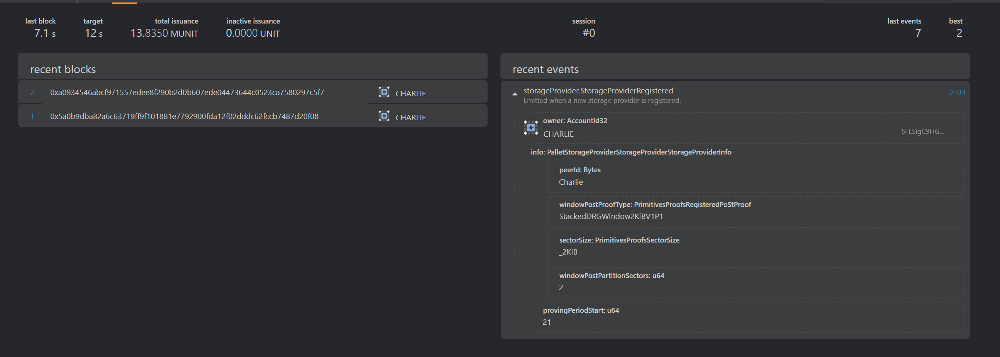

# Real-world use case demo

## 1. Publishing a deal

<div class="warning">
Before reading this guide, please ensure you've followed the <a href="./local-testnet.md">local testnet</a> guide and have a working testnet running!
</div>

Charlie heard that he can provide storage to people around the world and earn some tokens doing it, so he decided to register as a [Storage Provider](../glossary.md).

```bash
$ storagext-cli --sr25519-key "//Charlie" storage-provider register Charlie
2024-08-26T14:18:44.280186Z  INFO run{address="5FLSigC9HGRKVhB9FiEo4Y3koPsNmBmLJbpXg2mp1hXcS59Y"}: storagext_cli::cmd::storage_provider: [0x9a07…aaec] Successfully registered Charlie, seal: StackedDRGWindow2KiBV1P1 in Storage Provider Pallet
```



Alice is a [Storage User](../glossary.md#storage-user) and wants to store an image of her lovely Husky (`husky.jpg`) in the Polka Storage [parachain](../glossary.md#parachain).

Alice knows[^no-cid] that she needs to get a [CID](https://github.com/multiformats/cid) of the image, so she [uploaded it to the CAR server](../storage-provider-cli/storage.md#upload-a-file)
and received the CID: `bafybeihxgc67fwhdoxo2klvmsetswdmwwz3brpwwl76qizbsl6ypro6vxq`.

Alice heard somewhere[^no-sp-discovery] in the hallways of her favourite gym that Charlie is a Storage Provider.
She calls him (off-chain) and they negotiate a deal:

`husky-deal.json`

```json
[
  {
    "piece_cid": "bafybeihxgc67fwhdoxo2klvmsetswdmwwz3brpwwl76qizbsl6ypro6vxq",
    "piece_size": 1278,
    "client": "5GrwvaEF5zXb26Fz9rcQpDWS57CtERHpNehXCPcNoHGKutQY",
    "provider": "5FLSigC9HGRKVhB9FiEo4Y3koPsNmBmLJbpXg2mp1hXcS59Y",
    "label": "My lovely Husky (husky.jpg)",
    "start_block": 25,
    "end_block": 50,
    "storage_price_per_block": 1000000000,
    "provider_collateral": 12500000000,
    "state": "Published"
  }
]
```

| Name                      | Value                                                                                                                         | Description                                                                                                              |
| ------------------------- | ----------------------------------------------------------------------------------------------------------------------------- | ------------------------------------------------------------------------------------------------------------------------ |
| `piece_cid`               | `bafybeihxgc67fwhdoxo2klvmsetswdmwwz3brpwwl76qizbsl6ypro6vxq`                                                                 | The submitted file's CID                                                                                                 |
| `piece_size`              | `1278`                                                                                                                        | The submitted file's size                                                                                                |
| `client`                  | [`//Alice`](https://docs.substrate.io/reference/glossary/#dev-phrase) or `5GrwvaEF5zXb26Fz9rcQpDWS57CtERHpNehXCPcNoHGKutQY`   | The client's address                                                                                                     |
| `provider`                | [`//Charlie`](https://docs.substrate.io/reference/glossary/#dev-phrase) or `5FLSigC9HGRKVhB9FiEo4Y3koPsNmBmLJbpXg2mp1hXcS59Y` | The providers's address                                                                                                  |
| `start_block`             | `25`                                                                                                                          | When the deal should start                                                                                               |
| `end_block`               | `50`                                                                                                                          | When the deal should end                                                                                                 |
| `storage_price_per_block` | `1_000_000_000`                                                                                                               | In [Plancks](../glossary.md#planck), the storage price per block (12 sec)                                                |
| `provider_collateral`     | `12_500_000_000`                                                                                                              | In [Plancks](../glossary.md#planck), the price paid by the storage provider if they fail to uphold their end of the deal |

After the negotiation, they need to [add funds to the Pallet](../pallets/market.md#add_balance) and then [publish their intent](../pallets/market.md#publish_storage_deals) so it can be checked by the parachain.
So here they go:

```bash
# Adding balance to Alice's account
$ storagext-cli --sr25519-key "//Alice" market add-balance 25000000000
2024-08-26T13:08:27.090149Z  INFO run{address="5GrwvaEF5zXb26Fz9rcQpDWS57CtERHpNehXCPcNoHGKutQY"}: storagext_cli::cmd::market: [0x034f…b800] Successfully added 25000000000 to Market Balance
# Adding balance to Charlie's account
$ storagext-cli --sr25519-key "//Charlie" market add-balance 12500000000
2024-08-26T13:09:51.130294Z  INFO run{address="5FLSigC9HGRKVhB9FiEo4Y3koPsNmBmLJbpXg2mp1hXcS59Y"}: storagext_cli::cmd::market: [0xdd8e…18f2] Successfully added 12500000000 to Market Balance
# Publishing their deal
$ storagext-cli --sr25519-key  "//Charlie" market publish-storage-deals --client-sr25519-key  "//Alice" "@husky-deal.json"
2024-08-26T13:10:21.260228Z  INFO run{address="5FLSigC9HGRKVhB9FiEo4Y3koPsNmBmLJbpXg2mp1hXcS59Y"}: storagext_cli::cmd::market: [0xd547…161d] Successfully published storage deals
```

[^no-cid]: We have not provided a standalone command to generate CID out of file. The CAR server is a temporary showcase component.
[^no-sp-discovery]: We have not implemented Storage Provider Discovery protocol yet.

## 2. Committing a deal

After the deals have been published, the rest is up to Charlie.
If Charlie does not behave properly _and_ does not [pre-commit](../pallets/storage-provider.md#pre_commit_sector) and [prove](../pallets/storage-provider.md#prove_commit_sector) the deal by block 25 (`start_block`),
he is going to be slashed and all of his funds [(`provider_collateral`)](../glossary.md#collateral) - gone.[^slash]
So it's better he does his part!

`pre-commit-husky.json`

```json
{
  "sector_number": 1,
  "sealed_cid": "bafk2bzaceajreoxfdcpdvitpvxm7vkpvcimlob5ejebqgqidjkz4qoug4q6zu",
  "deal_ids": [0],
  "expiration": 75,
  "unsealed_cid": "bafk2bzaceajreoxfdcpdvitpvxm7vkpvcimlob5ejebqgqidjkz4qoug4q6zu",
  "seal_proof": "StackedDRG2KiBV1P1"
}
```

| Name                                       | Value    | Description                                                                                                       |
| ------------------------------------------ | -------- | ----------------------------------------------------------------------------------------------------------------- |
| [`sector_number`](../glossary.md#sector)   | 1        | The place where `husky.jpg` will be stored. Charlie decided it'll be on his 1st sector                            |
| `deal_ids`                                 | `[0]`    | A sector can contain multiple deals, but it only contains the first one ever created (id: 0)                      |
| `expiration`                               | `75`     | The 75th, which is 5 minutes after the `end_block`, so the sector expires only after the deal has been terminated |
| `sealed_cid`, `unsealed_cid`, `seal_proof` | multiple | Currently placeholder values since the proof mechanism is a work-in-progress                                      |

`prove-commit-husky.json`

```json
{
  "sector_number": 1,
  "proof": "1230deadbeef"
}
```

- `proof`: hex string of bytes of the proof[^sealing-subsystem]

```bash
$ storagext-cli --sr25519-key "//Charlie" storage-provider pre-commit "@pre-commit-husky.json"
2024-08-26T14:34:41.710197Z  INFO run{address="5FLSigC9HGRKVhB9FiEo4Y3koPsNmBmLJbpXg2mp1hXcS59Y"}: storagext_cli::cmd::storage_provider: [0x28ef…801e] Successfully pre-commited sector 1.
$ storagext-cli --sr25519-key "//Charlie" storage-provider prove-commit "@prove-commit-husky.json"
2024-08-26T14:36:41.780309Z  INFO run{address="5FLSigC9HGRKVhB9FiEo4Y3koPsNmBmLJbpXg2mp1hXcS59Y"}: storagext_cli::cmd::storage_provider: [0xbef5…a305] Successfully proven sector 1.
```


[^sealing-subsystem]: sealing and proving process are WIP, so just trust us on this one and use any valid CID values (the ones we provided are fine).
[^slash]: You can just wait for 5 minutes and observe a `DealSlashed` [Event](../pallets/market.md#events) being published.

## 3. Proofs and faults

`window-proof.json`

```json
{
  "deadline": 0,
  "partitions": [0],
  "proof": {
    "post_proof": "2KiB",
    "proof_bytes": "1230deadbeef"
  }
}
```

<!-- deadline is 0, until #277 (before that we need to query the state) -->

- `deadline`: 0, don't worry about it.
- `partitions`: [0] - always 0, don't worry about it
- `post_proof`: "2KiB", don't worry about it
- `proof_bytes`: hex string of bytes of the proof[^sealing-subsystem]

Now that the sector has been proven, Charlie needs to keep confirming that he stores the data.
Charlie's proving period starts at block `21`, so the first deadline is between blocks `[21, 31)`, second `[31, 41)`.
Charlie got assigned the first deadline, so he waits until the block `21`, to send his proof that he stores the data.

```bash
$ storagext-cli --sr25519-key "//Charlie" storage-provider submit-windowed-post "@windowed-post.json"
2024-08-26T15:30:14.720225Z  INFO run{address="5FLSigC9HGRKVhB9FiEo4Y3koPsNmBmLJbpXg2mp1hXcS59Y"}: storagext_cli::cmd::storage_provider: [0xa233…1f9d] Successfully submitted proof.
```


The next proving period starts at block `41`, and deadline `[41, 51)`, so Charlie would need to submit his proof on this block.
He knows that he won't be able to create a proof, as his hard drives went down, so he reports it. If he didn't report, he'd get slashed.

`fault-declaration.json`

```json
[
  {
    "deadline": 0,
    "partition": 0,
    "sectors": [1]
  }
]
```

```bash
$ storagext-cli --sr25519-key "//Charlie" storage-provider declare-faults "@fault-declaration.json"
2024-08-27T09:30:05.860278Z  INFO run{address="5FLSigC9HGRKVhB9FiEo4Y3koPsNmBmLJbpXg2mp1hXcS59Y"}: storagext_cli::cmd::storage_provider: [0xbda5…a61f] Successfully declared faults.
```


Charlie fixed his issues with storage and now wants to declare that he's still able to provide data in this sector.
If he does this too late (1 minute before the next deadline starts), he won't be able to.

```bash
$ storagext-cli --sr25519-key "//Charlie" storage-provider declare-faults-recovered "@fault-declaration.json"
Error: Runtime error: Pallet error: StorageProvider::FaultRecoveryTooLate

Caused by:
    Pallet error: StorageProvider::FaultRecoveryTooLate
```

<!-- it doesn't work until: #281 is fixed -->

If he does it at least a minute before, it succeeds:

```bash
$ storagext-cli --sr25519-key "//Charlie" storage-provider declare-faults-recovered "@fault-declaration.json"
2024-08-27T09:31:05.860278Z  INFO run{address="5FLSigC9HGRKVhB9FiEo4Y3koPsNmBmLJbpXg2mp1hXcS59Y"}: storagext_cli::cmd::storage_provider: [0xbda5…a61f] Successfully declared faults.
```

And then, at the next deadline, in the next proving period `[41, 51)` he needs to remember to submit windowed PoSt again.

```bash
$ storagext-cli --sr25519-key "//Charlie" storage-provider submit-windowed-post "@windowed-post.json"
2024-08-27T09:32:05.860278Z INFO run{address="5FLSigC9HGRKVhB9FiEo4Y3koPsNmBmLJbpXg2mp1hXcS59Y"}: storagext_cli::cmd::storage_provider: [0xa233…1f9d] Successfully submitted proof.
```

## 4. Reaping the rewards

After the deal has ended (after block 75), Charlie goes to get his rewards!
First he settles all of the collaterals, so his balance gets unlocked and then he withdraw balance to use his DOTs for a new shiny dumbbell.

<!-- it ain't working yet, probably until: #278 is done -->

```bash
$ storagext-cli --sr25519-key "//Charlie" market settle-deal-payments 0
2024-08-26T15:33:26.820285Z  INFO run{address="5FLSigC9HGRKVhB9FiEo4Y3koPsNmBmLJbpXg2mp1hXcS59Y"}: storagext_cli::cmd::market: [0x9aa4…dcdd] Successfully settled deal payments
$ storagext-cli --sr25519-key "//Charlie" market withdraw-balance 25000000000
```
