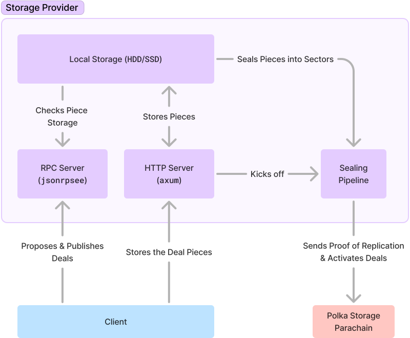

# Polka Storage Provider — Server

In this chapter we'll cover the server's architecture as well as the CLI's options.

<!-- Sadly, tables will not cut it here, since the text is just too big for the table. -->

## Server Architecture

<!-- NOTE: the image gets f'd up in dark backgrounds and css isn't helping, ill need to make a new svg, for now just use a lighter mode -->

The server has two main fronts, the JSON-RPC API which provides an "interactive" interface for users to submit deal proposals to the storage provider,
and the HTTP API which consists of a single endpoint where users are to submit their data.

The user is first required to propose a deal, which once accepted (signaled by the return of a CID) allows the user to submit a file
(using `curl` for example) to the server; finally the user can then publish a signed deal to the storage provider.

The responsibility then falls on to the storage provider to seal, publish and activate the deal on the Polka Storage parachain.

<!-- TODO: remove the download API from the server until we implement deal retrieval -->

### CLI Options

#### `--upload-listen-address`

The storage server's endpoint address — i.e. where you will upload your files to.

It takes in an IP address along with a port in the format: `<ip>:<port>`.
Defaults to `127.0.0.1:8001`.

#### `--rpc-listen-address`

The RPC server endpoint's address — i.e. where you will submit your deals to.

It takes in an IP address along with a port in the format: `<ip>:<port>`.
Defaults to `127.0.0.1:8000`.

#### `--node-url`

The target parachain node's address — i.e. the parachain node the storage provider will submit deals to, etc.

It takes in an URL, it supports both HTTP and WebSockets and their secure variants.
Defaults to `ws://127.0.0.1:42069`.

### `--sr25519-key`

Sr25519 keypair, encoded as hex, BIP-39 or a dev phrase like `//Alice`.

See [`sp_core::crypto::Pair::from_string_with_seed`](https://docs.rs/sp-core/latest/sp_core/crypto/trait.Pair.html#method.from_string_with_seed) for more information.

If this `--sr25519-key` is not used, either [`--ecdsa-key`](#--ecdsa-key) or [`--ed25519-key`](#--ed25519-key) MUST be used.

### `--ecdsa-key`

ECDSA keypair, encoded as hex, BIP-39 or a dev phrase like `//Alice`.

See [`sp_core::crypto::Pair::from_string_with_seed`](https://docs.rs/sp-core/latest/sp_core/crypto/trait.Pair.html#method.from_string_with_seed) for more information.

If this `--ecdsa-key` is not used, either [`--sr25519-key`](#--sr25519-key) or [`--ed25519-key`](#--ed25519-key) MUST be used.

### `--ed25519-key`

Ed25519 keypair, encoded as hex, BIP-39 or a dev phrase like `//Alice`.

See [`sp_core::crypto::Pair::from_string_with_seed`](https://docs.rs/sp-core/latest/sp_core/crypto/trait.Pair.html#method.from_string_with_seed) for more information.

If this `--ed25519-key` is not used, either [`--ecdsa-key`](#--ecdsa-key) or [`--sr25519-key`](#--sr25519-key) MUST be used.

### `--database-directory`

The RocksDB storage directory, where deal information will be kept.

It takes in a valid folder path, if the directory does not exist, it will be created along with all intermediate paths.
Defaults to a pseudo-random temporary directory — `/tmp/<random string>/deals_database`.

### `--storage-directory`

The piece storage directory, where pieces will be kept stored in.

It takes in a valid folder path, the directory does not exist, it will be created along with all intermediate paths.
Defaults to a pseudo-random temporary directory — `/tmp/<random string>/...`.

Storage directories like the pieces, unsealed and sealed directories will be created under it.

### `--seal-proof`

The kind of replication proof. Currently, only `StackedDRGWindow2KiBV1P1` is supported to which it defaults.

### `--post-proof`

The kind of storage proof. Currently, only `StackedDRGWindow2KiBV1P1` is supported to which it defaults.
