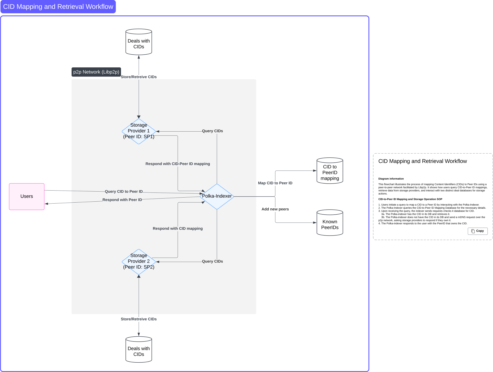

# RFC: Polka-index

## Abstract

This document describes Polka-index, a indexing application that maps Content Identifiers (CIDs) to the Peer IDs of storage providers in a peer-to-peer (p2p) network. Users interact with Polka-index through a simple HTTP API, while Polka-Indexer communicates with storage providers over the p2p network using [libp2p](https://docs.libp2p.io/)'s dialing mechanism. This document outlines the system's architecture, key components, and communication protocols.

## 1. Introduction

In the polka-storage system it can be hard to find which CID is owned by which storage provider. Polka-index solves this problem by connecting CIDs (unique identifiers for files) to the Peer IDs of storage providers who store them.

Storage providers store files outside the scope of the p2p network. Instead, they use the network to broadcast their Peer IDs and respond to CID queries from the Polka-Indexer. Users can easily request CID-to-Peer ID mappings from the Polka-Indexer via HTTP.

This document explains how the system works, detailing how users, the Polka-Indexer, and storage providers interact in the network.

## Terminology

- **CID (Content Identifier)**: A unique identifier for a file stored by a storage provider.
- **Peer ID**: A unique identifier for a node in the p2p network.
- **Storage Provider**: A node in the network that stores files and manages a database of CIDs but uses the p2p network only to share Peer IDs and provide CID mappings.
- **Deal Database**: A local database in each storage provider where CIDs and metadata about stored files are recorded.
- **Polka-Indexer**: The node responsible for querying storage providers and maintaining a database of CID-to-Peer ID mappings. It also provides an HTTP API for users.
- **mDNS (Multicast DNS)**: A protocol used for discovering peers within the local p2p network.
- **Dialing**: The process in [libp2p](https://docs.libp2p.io/) where one peer establishes a direct connection to another peer using its Peer ID.

## 3. System Overview

### 3.1 Components

#### Storage Providers Component

- Connect to the p2p network using unique Peer IDs.
- Broadcast their Peer IDs using mDNS so they can be discovered by the Polka-Indexer.
- Maintain a Deal Database containing the CIDs and metadata for the files they store.
- Respond to Polka-Indexer queries via dialing.

#### Polka-Index Component

- Connects to the p2p network using its own unique Peer ID.
- Detects storage providers through mDNS broadcasts.
- Dials storage providers directly to query for CID mappings.
- Maintains a CID-to-Peer ID mapping database.
- Provides an HTTP API for users to request CID-to-Peer ID mappings.

#### p2p Network

- A communication layer powered by [libp2p](https://docs.libp2p.io/) that supports Peer ID discovery (via mDNS) and direct connections (via dialing).
Users
- Connect to the Polka-Indexer via HTTP to find out which Peer ID is associated with a specific CID.

### 3.2 How It Works

1. Storage providers connect to the p2p network and broadcast their Peer IDs using mDNS.
2. Polka-Indexer listens for these broadcasts and keeps track of active storage providers.
3. Users send an HTTP request to the Polka-Indexer, asking for the Peer ID associated with a specific CID.
4. If the CID isn’t already in its database, the Polka-Indexer dials storage providers directly to ask for the mapping.
5. The storage provider responds with the CID-to-Peer ID mapping.
6. Polka-Indexer stores the mapping for future use and returns the Peer ID to the user.

### 3.3 Architecture Diagram

The following diagram illustrates the architecture of Polka-index:



### 4. Architectural Details

#### Storage Providers Component

- **Peer ID**: Each storage provider generates a Peer ID when it connects to the p2p network. This ID is broadcast via mDNS for discovery.
- **Deal Database**: A lightweight database where storage providers keep records of CIDs and file metadata. File storage itself is external to the p2p network.
- **Dialing**: Responds to direct queries from the Polka-Indexer to provide CID-to-Peer ID mappings.

#### Polka-Index Component

- **Peer ID**: The Polka-Indexer has its own Peer ID for identifying itself in the p2p network.
- **mDNS Discovery**: It listens for Peer ID broadcasts to discover active storage providers.
- **CID Mapping Database**: Stores CID-to-Peer ID mappings retrieved from storage providers. This database powers the HTTP API for user queries.
- **HTTP API**: Provides a simple interface for users:

**Request**:

```json
{ "cid": "<CID>" }
```

**Response**:

```json
{ "cid": "<CID>", "peer_id": "<PeerID>" }
```

### 5. Communication Protocols

#### mDNS Protocol

- **Broadcast**: When a storage provider connects to the network, it broadcasts its Peer ID using mDNS.
- **Discovery**: Polka-Indexer detects these broadcasts and tracks active storage providers.

#### Query Protocol (p2p Network)

- **Request**: Polka-Indexer dials a storage provider with a query for a specific CID.
- **Response**: The storage provider returns the CID and its associated Peer ID.

#### User Query Protocol (HTTP)

- **Request**: Users query the Polka-Indexer using a simple HTTP GET request. Example:

```json
{ "cid": "<CID>" }
```

- **Response**: Polka-Indexer responds with the mapping. Example:

```json
{
  "cid": "<CID>",
  "peer_id": "<PeerID>"
}
```

### 6. Scalability and Performance

Polka-index is designed to scale across a growing number of storage providers and users:

- mDNS Discovery: Enables seamless detection of storage providers as they join or leave the network.
- Dialing: Ensures efficient, direct communication between the Polka-Indexer and storage providers.
- HTTP API: Allows users to interact with the system easily, with minimal overhead.

### 7. References

[libp2p Documentation](https://docs.libp2p.io/)
